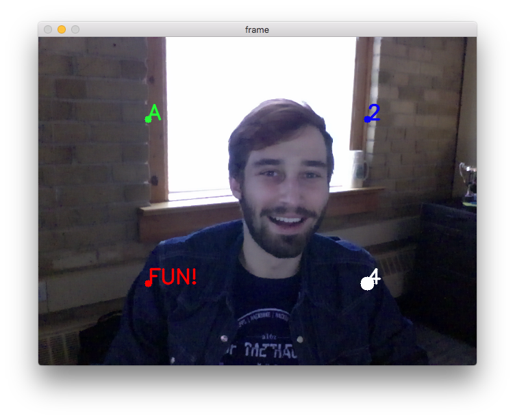

# Frame Recorder

The Frame Recorder is a python script which records frames from a webcam.
It supports labeling frames for data collection purposes. When labels are given, the recorder can include custom labels when holding a desired key button. See the *Using Labels* section for more information.

## Usage

For full usage instructions use the `-h` flag.
```
./frame_recorder.py -h
```

### Saving all frames to a folder
```
./frame_recorder.py -a <folder_name>
```

The `-a` flag tells the frame recorder to save all frames. The format is `frame_<index>.jpg` where `<index>` is the incremental id of each saved frame.

### Specifying the camera
```
./frame_recorder.py -c <camera_index> <folder_name>
```
The camera index should be an integer (e.g. *3*). These indexes map to OpenCV's list of cameras.

Unfortunately there is [currently no easy way to get a reliable list of cameras from OpenCV](http://stackoverflow.com/a/7323964). So trial and error is required if using to select from more than one webcam.

### Flipping the image
```
./frame_recorder.py -F <folder_name>
```
Will flip the image displayed and saved horizontally (about the x-axis).

### Using Labels

If you would like to use labels during frame collection, create a labels JSON file.

**labels.json**
```
{
  "w": "label_a",
  "s": "label_b",
  "d": "label_c"
}
```

Then run the recorder with your specified labels file:
```
./frame_recorder.py -l labels.json <folder_name>
```

This will tell the recorder to append the labels *label_a*, *label_b*, and *label_c* to the frame file name when holding the *w*, *a*, and *d* keys respectively.

For example, pressing *w* will cause the frame saved to be named `frame_23_label_a.jpg`. In general the format is `<prefix>_<index>_<label>.<file_type>`.

If you would like to save unlabeled frames (i.e. no button pressed), use the `-a` flag. Frames with no label will be named in the format of `<prefix>_<index>.<file_type>`.

### Selecting image dimensions
```
./frame_recorder.py -w <width> -H <height> <folder_name>
```

### Selecting output format and options
```
./frame_recorder.py -t <jpg|png>
```

Controlling the quality of JPEG files can be done with the `-q` option with values between *0–100*. The default is *95*.
```
./frame_recorder.py -t jpg -q 60
```

Controlling the compression level of PNG files can be done with the `-C` option with values between *0–9*. The default is *3*.
```
./frame_recorder.py -t png -C 7
```

### Custom file names
```
./frame_recorder.py -p <prefix> <folder_name>
```
This will cause the files to be output to `<folder_name>/<prefix>_<index>.jpg`.

For example, this can be used if you would like the files to start with *monkey* and be put into the folder *zoo*.
```
./frame_recorder.py -p monkey zoo
```
The files will be output to `zoo/monkey_<index>.jpg`.

### Specifying frames per second (FPS)
```
./frame_recorder.py -f <fps> <folder_name>
```

If you would like *30* frames per second:
```
./frame_recorder.py -f 30 <folder_name>
```

If you would like to take a frame every 5 seconds, the fps would have to be *0.2*. This is calculated from the formula where *time delta* is in seconds:
```
(time delta) = 1/fps
fps = 1/(time delta)
```

The default is *20* frames per second.

### Saving with timestamps
```
./frame_recorder.py -T <folder_name>
```

This will cause the files to be output to `<folder_name>/frame_<timestamp>.jpg`. For example, the output may look like:

> output/frame_1445030960.31.jpg

### Dots overlay

If you would like to generate dot overlays, use the `--dots` flag with a dots JSON file.

**dots.json**
```
[
  {
    "x": 0.25,
    "y": 0.25,
    "color": [0, 255, 0],
    "size": 5,
    "label": "A"
  },
  {
    "x": 0.75,
    "y": 0.25,
    "color": [255, 0, 0],
    "size": 5,
    "label": "2"
  },
  {
    "x": 0.25,
    "y": 0.75,
    "color": [0, 0, 255],
    "size": 5,
    "label": "FUN!"
  },
  {
    "x": 0.75,
    "y": 0.75,
    "color": [255, 255, 255],
    "size": 10,
    "label": "4"
  }
]
```

Note: The *x*, *y*, *color*, and *size* fields are **required**.

Running the following command will produce the preview window below.
```
./frame_recorder.py --dots dots.json <folder_name>
```


The dots and text will not be saved during recording.


## Full usage
```
usage: frame_recorder.py [-h] [-v] [-c CAPTURE_DEVICE] [-w WIDTH] [-H HEIGHT]
                         [-f FPS] [-a] [-p PREFIX] [-l LABELS] [-t {jpeg,png}]
                         [-q {0,5,10,15,20,25,30,35,40,45,50,55,60,65,70,75,80,85,90,95,100}]
                         [-C {0,1,2,3,4,5,6,7,8,9}]
                         folder

Records frames

positional arguments:
  folder                Folder to save frames to

optional arguments:
  -h, --help            show this help message and exit
  -v, --verbose
  -c CAPTURE_DEVICE, --capture-device CAPTURE_DEVICE
                        Index of capture device
  -w WIDTH, --width WIDTH
                        Width of video stream
  -H HEIGHT, --height HEIGHT
                        Height of video stream
  -f FPS, --fps FPS     FPS to record at
  -a, --save-all        FPS to record at
  -p PREFIX, --prefix PREFIX
                        Prefix of file name
  -l LABELS, --labels LABELS
                        JSON mapping of keys to labels
  -t {jpeg,png}, --file-type {jpeg,png}
                        File type
  -q {0,5,10,15,20,25,30,35,40,45,50,55,60,65,70,75,80,85,90,95,100}, --file-quality {0,5,10,15,20,25,30,35,40,45,50,55,60,65,70,75,80,85,90,95,100}
                        Quality of saved file. Applicible only to JPEG format
  -C {0,1,2,3,4,5,6,7,8,9}, --file-compression {0,1,2,3,4,5,6,7,8,9}
                        Compression level of saved file. Applicible only to
                        PNG format
  -T, --with-timestamps
                      Replaces indexes with timestamps in the file names
```

## Known Issues

### Unlabeled Frames
When holding a key for a label, some frames may be saved without a label.

### Mac OS X: External Cameras not Working
When attempting to use an external USB camera, select it with the `-c` flag does not select the camera and the program quits. This is due to OpenCV not finding the camera. One solution that has worked is to recompile OpenCV 2 in 32-bit mode.

```
brew reinstall opencv --32-bit
```

Attempting with OpenCV 3 does not work.
